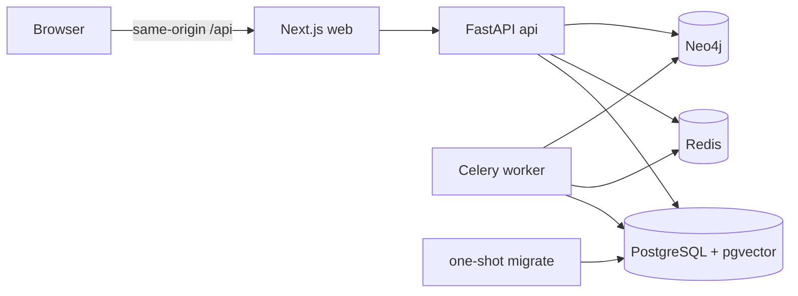

# CoursePilot

CoursePilot 是一个面向高校计算机课程的知识图谱增强个性化学习 Agent。首版聚焦数据结构与操作系统，并把教师提供的课程资料作为唯一权威知识来源。未经教师审核的知识关系和题目不能进入学生正式问答、掌握度或学习路径；证据不足时系统必须明确拒答。

当前仓库已具备基础能力：Next.js Web、FastAPI API、Celery Worker、PostgreSQL/pgvector、Redis、Neo4j、数据库迁移和 CI 被组织为一个可复现的本地开发栈。后续能力按依赖关系连续推进；规格中的质量门槛仍是冻结评测的验收目标，本仓库不预填任何实验结果。

## 本地启动

需要 Docker Desktop（Linux containers）和 Docker Compose v2。Windows 用户应把仓库放在 Docker Desktop 已共享的磁盘中，并确保 Docker daemon 已启动。

1. 创建本地环境文件：

   ```powershell
   Copy-Item .env.example .env
   ```

   macOS/Linux 对应命令为 `cp .env.example .env`。本地启动前至少替换 `POSTGRES_PASSWORD`、`DATABASE_URL`、`REDIS_PASSWORD`、`REDIS_URL`、`NEO4J_PASSWORD` 和 `JWT_SECRET`；URL 中的密码必须与对应服务密码一致。

2. 验证并启动：

   ```powershell
   docker compose config --quiet
   docker compose up --build --detach
   docker compose ps
   ```

   `migrate` 是一次性服务，会先在干净数据库上执行 `alembic upgrade head`。成功后它显示为 `Exited (0)`，API 和 Worker 才会启动。

3. 检查入口：

   - Web：<http://localhost:3000>
   - Web 存活检查：<http://localhost:3000/healthz>
   - API 存活检查：<http://localhost:8000/health/live>
   - API 就绪检查：<http://localhost:8000/health/ready>
   - Neo4j Browser：<http://localhost:7474>

   `/health/ready` 会真实探测 PostgreSQL、Redis、Neo4j 和索引目录。示例配置默认关闭 LLM 探测，因为仓库不包含真实模型凭据；配置可用的 OpenAI-compatible 服务后，将 `READINESS_CHECK_LLM` 改为 `true`。

查看日志或停止服务：

```powershell
docker compose logs --follow api worker
docker compose down
```

`docker compose down` 会保留命名卷。只有明确要删除本地数据库、图数据、上传、索引和模型缓存时才使用 `docker compose down --volumes`。

## 服务拓扑



`api`、`worker` 和 `migrate` 复用同一个后端镜像。数据库、缓存、图数据、上传文件、词法索引和模型缓存均使用 Docker 命名卷；数据库端口只绑定到本机回环地址。应用容器使用只读根文件系统、移除 Linux capabilities，并启用 `no-new-privileges`。

## 本地开发与检查

前端使用根 pnpm workspace 和唯一锁文件：

```powershell
corepack enable
corepack prepare pnpm@11.19.0 --activate
pnpm install --frozen-lockfile
pnpm check:web
```

后端使用 Python 3.12+：

```powershell
Set-Location apps/api
python -m venv .venv
.\.venv\Scripts\python -m pip install -e ".[test]"
.\.venv\Scripts\alembic upgrade head
.\.venv\Scripts\pytest
```

CI 对每个提交执行后端迁移与测试、前端 lint/typecheck/build，以及 Compose 配置与容器内迁移冒烟。入口配置见 [`.env.example`](.env.example)，完整产品约束与里程碑见 [`spec.md`](spec.md)。

## 数据与安全边界

- 不提交真实教材、课程私有资料、API Key、JWT Secret 或数据库密码。
- 所有业务访问必须在服务端校验用户、角色、课程与资源归属。
- 未经教师审核的候选知识和题目不能影响学生。
- 只有教师审核题目的有效、幂等作答可以事务化更新掌握度。
- 新课程版本完成全部索引并通过验证前，继续使用旧的活动版本。
- CoursePilot 不实现代码执行、代码修改或开放网页研究。
