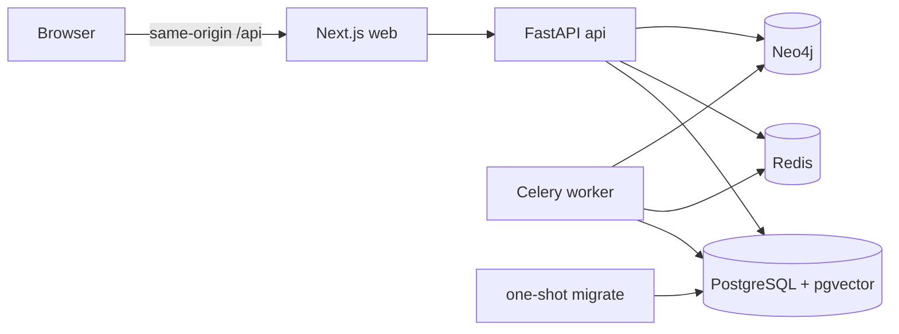

# CoursePilot

CoursePilot 是一个面向高校计算机课程的知识图谱增强个性化学习 Agent。首版聚焦数据结构与操作系统，并把教师提供的课程资料作为唯一权威知识来源。未经教师审核的知识关系和题目不能进入学生正式问答、掌握度或学习路径；证据不足时系统必须明确拒答。

当前仓库已实现 MVP 核心工程闭环：教师可创建课程、上传并解析资料、审核候选知识图谱与题目、发布课程版本并查看学习数据；学生可加入课程、进行带引用问答、完成诊断测验并查看掌握度、知识图谱、学习路径与历史。Next.js Web、FastAPI API、Celery Worker、PostgreSQL/pgvector、Redis、Neo4j、数据库迁移、冻结评测和 CI 被组织为一个可复现的本地开发栈。规格中的质量门槛仍需由真实语料上的冻结评测报告验收，本仓库不预填任何实验结果，也不把工程测试通过等同于模型效果达标。

## 本地启动

需要 Docker Desktop（Linux containers）和 Docker Compose v2。Windows 用户应把仓库放在 Docker Desktop 已共享的磁盘中，并确保 Docker daemon 已启动。

1. 创建本地环境文件：

   ```powershell
   Copy-Item .env.example .env
   ```

   macOS/Linux 对应命令为 `cp .env.example .env`。本地启动前至少替换 `POSTGRES_PASSWORD`、`DATABASE_URL`、`REDIS_PASSWORD`、`REDIS_URL`、`NEO4J_PASSWORD` 和 `JWT_SECRET`；URL 中的密码必须与对应服务密码一致。

2. 验证并启动：

   ```powershell
   docker compose config --quiet
   docker compose up --build --detach
   docker compose ps
   ```

   `migrate` 是一次性服务，会先在干净数据库上执行 `alembic upgrade head`。成功后它显示为 `Exited (0)`，API 和 Worker 才会启动。

3. 检查入口：

   - Web：<http://localhost:3000>
   - Web 存活检查：<http://localhost:3000/healthz>
   - API 存活检查：<http://localhost:8000/health/live>
   - API 就绪检查：<http://localhost:8000/health/ready>
   - API 文档：<http://localhost:8000/docs>
   - Neo4j Browser：<http://localhost:7474>

   `/health/ready` 会真实探测 PostgreSQL、Redis、Neo4j 和索引目录。示例配置默认关闭 LLM 探测，因为仓库不包含真实模型凭据；配置可用的 OpenAI-compatible 服务后，将 `READINESS_CHECK_LLM` 改为 `true`。

   后端镜像包含 BGE-M3 与 BGE Reranker 的运行依赖，但不打包模型权重。首次需要下载权重时，把 `.env` 中的 `MODEL_ALLOW_DOWNLOAD` 改为 `true`；权重写入命名卷，之后可恢复为 `false`。模型暂不可用时，系统会明确记录 Dense 索引为待处理并退化到词法检索，不会生成伪向量。

查看日志或停止服务：

```powershell
docker compose logs --follow api worker
docker compose down
```

`docker compose down` 会保留命名卷。只有明确要删除本地数据库、图数据、上传、索引和模型缓存时才使用 `docker compose down --volumes`。

## 开放样例与演示入库

仓库提供两份原创、`CC-BY-4.0` 的微型中文课程资料。服务启动且真实 BGE-M3 可用后运行：

```powershell
python scripts/seed_demo.py
```

脚本只通过公开 API 创建或复用教师、两门课程、文档版本和学生账号，等待真实 Worker 入库，审核带来源的概念、关系和题目，再发布索引。任何模型、Worker 或索引异常都会明确失败，不会伪造向量、状态或指标。语料说明和参数见 [`samples/README.md`](samples/README.md)。

## 冻结评测与三组基线

Teacher 可在评测中心创建并冻结 Retrieval 数据集。数据集必须包含人工确认的相关 Chunk；`kg_personalized` 的每个 Case 还必须指向真实在课 Student、已审核目标概念和实际 MasteryState。然后从 `apps/api` 运行：

```powershell
uv run python -m app.evaluation.runner --dataset-id <dataset-uuid> --index-version <version>
```

运行器会真实执行 `dense_only`、`hybrid_rerank` 和 `kg_personalized`，分别持久化 EvalRun，并向 `evaluation-reports/` 写入不可覆盖的版本化 JSON。报告固化 Git、数据集、索引、模型、Prompt、检索参数和硬件信息。缺少真实上下文时运行器会失败；测试中的 Fake provider 不会产生项目指标。

## 服务拓扑



`api`、`worker` 和 `migrate` 复用同一个后端镜像。数据库、缓存、图数据、上传文件、词法索引和模型缓存均使用 Docker 命名卷；数据库端口只绑定到本机回环地址。应用容器使用只读根文件系统、移除 Linux capabilities，并启用 `no-new-privileges`。

## 本地开发与检查

前端使用根 pnpm workspace 和唯一锁文件：

```powershell
corepack enable
corepack prepare pnpm@11.19.0 --activate
pnpm install --frozen-lockfile
pnpm check:web
```

后端使用 Python 3.12+：

```powershell
Set-Location apps/api
python -m venv .venv
.\.venv\Scripts\python -m pip install -e ".[test]"
.\.venv\Scripts\alembic upgrade head
.\.venv\Scripts\pytest
```

本机需要运行真实 BGE 检索时，再安装 ML 依赖：

```powershell
.\.venv\Scripts\python -m pip install -e ".[ml]"
```

CI 对每个提交执行后端迁移与测试、前端 lint/typecheck/build，以及 Compose 配置与容器内迁移冒烟。入口配置见 [`.env.example`](.env.example)，完整产品约束与里程碑见 [`spec.md`](spec.md)。

## 数据与安全边界

- 不提交真实教材、课程私有资料、API Key、JWT Secret 或数据库密码。
- 所有业务访问必须在服务端校验用户、角色、课程与资源归属。
- 未经教师审核的候选知识和题目不能影响学生。
- 只有教师审核题目的有效、幂等作答可以事务化更新掌握度。
- 新课程版本完成全部索引并通过验证前，继续使用旧的活动版本。
- CoursePilot 不实现代码执行、代码修改或开放网页研究。
