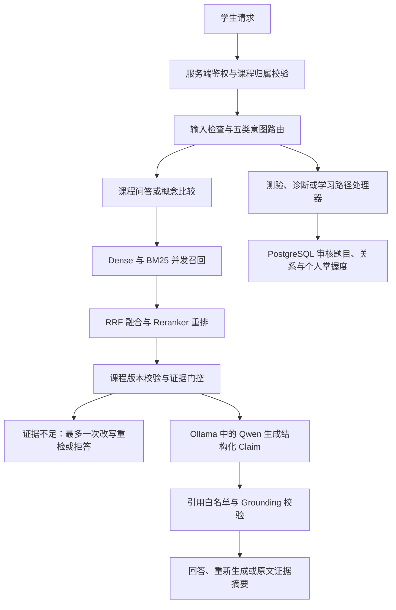
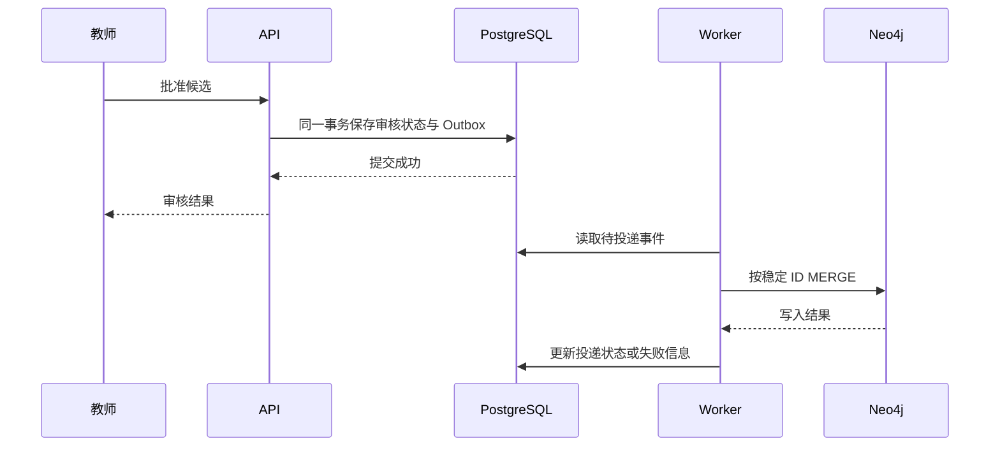

# CoursePilot 简历逐条讲解与面试追问手册

> 2026-09-12 同步：最终四条正文见 [简历项目块](coursepilot-resume-final.md)，新增 [配套说明](coursepilot-resume-guide.md)。微调两轮实验和引用计数修复均已完成；下文代码细节基于 2026-09-07 审计，后续变更在对应章节注明，不把历史审计日期冒充本次全面代码复核。

核对日期：2026-09-07。代码基准：`daba269`。面向尚未熟悉项目原理的学习者。

本文依据当前代码、规格与已归档实验解释项目，不使用淘汰的个人简历。文中的例子用于解释原理，不是新增实验结果。标为“后续方案”的能力不能当作已实现功能。

## 1. 先用一个问题理解整个项目

学生问：“为什么虚拟内存需要页面置换？”系统先确认学生有这门课的访问权，再去已发布的课程资料中寻找证据，根据证据组织回答并附上原文。学生如果改问“我应该先学什么”，系统会走学习路径处理器；如果要求“考考我”，则获取审核题目。答题后才更新掌握度。

这解决了三个不同问题：回答有没有依据、知识和题目能否被教师治理、学习状态是否有可追溯的来源。面试时先讲这三个问题，再讲框架和数据库。

“可信”在这里是工程目标：约束来源、权限、引用和状态变更。它不表示系统能够保证每句话绝对正确。

### 当前主要调用链



这是主要分工图，不代表所有请求都执行所有节点；改写后仍会重新检查证据，学习动作也有自己的状态与权限校验。

### 三个模型、三个数据服务，不要混淆

| 名称 | 是什么 | 本项目做什么 | 不负责什么 |
|---|---|---|---|
| Qwen3:4b | 生成式语言模型 | 根据证据输出结构化回答 | 不直接修改掌握度或决定权限 |
| Ollama | 模型加载与推理服务 | 在本机运行 Qwen，提供 HTTP 调用入口 | 本身不是 Qwen，也不是向量数据库 |
| BGE-M3 | 文本嵌入模型 | 把问题和 Chunk 编成向量 | 不生成最终自然语言答案 |
| BGE Reranker | 问题与候选文本联合打分模型 | 对少量候选重新排序 | 不存储课程资料 |
| PostgreSQL + pgvector | 关系数据库及其向量扩展 | 保存业务事实、事务数据与向量 | pgvector 不是另一个独立数据库进程 |
| Redis | 内存数据服务 | 在此主要作为 Celery 消息中间件 | 没有证据支持“已实现回答缓存命中优化” |
| Neo4j | 图数据库 | 保存审核事实的图谱投影 | 当前学生学习路径主入口并不直接调用它 |

## 2. 适合当前实现的简历表述

统一使用 [2026-09-12 最终项目块](coursepilot-resume-final.md)，四条依次为可信问答、检索优化、数据与状态治理、模型微调。
本手册第 3–5 节对应前两条，第 6–8 节解释状态治理，微调见 [专项手册](qwen3-finetuning-explained.md)。
数字映射与一分钟介绍见 [最终版配套说明](coursepilot-resume-guide.md)。个人贡献表述须与能解释、复现的工作一致。

### 本次核对对旧稿的纠正

1. 默认意图路由是确定性规则；没有证据表明在线默认由 LLM 做分类。
2. 默认查询改写是拼接问题和目标概念；有扩展接口不代表已经调用模型改写。
3. 当前知识候选抽取以标题和显式关系规则为主，不宜称为已经完成通用 LLM 图谱抽取。
4. 学生学习路径读取 PostgreSQL 的审核关系，在 Python 中计算；不能说所有路径都通过 Neo4j 多跳查询生成。
5. `kg_personalized` 是评测中的个性化重排基线，不能直接称为在线问答全面接入 GraphRAG。
6. 10/8/5 是正式实验参数；当前 `HybridRetrievalConfig` 默认是 20/20/5，在线构建入口没有显式切到实验参数。
7. 历史引用准确率存在归因选择偏差，2026-09-11 已修复生成配对计数；旧“100%”仍不得用于简历，词法代理不等于语义支持。第 11 节解释原因。
8. 当前已有 Outbox、重试和稳定 ID 的 MERGE，但不能宣称所有乱序、并发重复和投影丢失场景都已可靠解决。第 7 节给出实际缺口。

## 3. 第一条：可信 Agent 工作流

### 3.1 Agent、RAG、Agentic RAG 分别是什么

RAG 是检索增强生成：先找资料，再让模型根据资料回答。它不需要把教材重新训练进模型权重。更新课程时，主要更新资料与索引。

Agent 通常意味着系统围绕目标选择动作、使用工具或状态，并根据结果继续执行。CoursePilot 的自主程度较低，流程受到明确限制。面试可以称为“受控工作流式 Agentic RAG”，并说明没有开放式通用工具循环。

这里的 Agent 价值来自业务分流：解释概念走检索生成，测验走审核题库，路径走确定性图算法。并非所有事情都必须由 LLM 决策。

### 3.2 输入检查、路由和预算是什么

输入检查负责格式、长度和危险信号；鉴权负责“是谁、有无权限”，两者不能互相替代。把恶意提示词拦下来，并不等于具备完整的 Prompt Injection 防御。

路由支持五类意图：课程问答、概念比较、诊断、测验、学习路径。当前默认按规则匹配，结构由 Pydantic 检查；存在可选模型路由适配接口，但默认没有注入该适配器。

预算用来限制系统反复尝试，例如查询改写最多一次。证据始终不够时继续循环，既增加时间和费用，也可能引入越来越偏离原问题的资料。

“查询改写”不能与“生成失败重试”混为一谈：前者改变检索输入；后者要求模型重新输出符合契约的答案。HTTP 瞬时错误重试又是第三层机制。

### 3.3 为什么不用 LangGraph

可讲的回答：

> 当前流程只有少量固定分支，重点是每一步权限、证据和预算可检查，因此使用自研显式编排。这样能直接看到何时检索、何时拒答，以及哪些动作会写数据库。代价是没有自动获得成熟框架的持久化检查点和复杂状态回放能力。后续如果出现长流程中断恢复、多轮人审等待，再评估引入框架。

追问“LangGraph 也能做确定性流程，为什么说不用它才安全？”

> 确实能做。安全来自应用层约束，与采用哪个框架没有必然关系。这里是当前复杂度下的依赖和实现成本选择，没有做过证明自研更快的框架对照实验。

追问“规则路由会不会太弱？”

> 会。规则对固定表达可解释、成本低，但隐含意图、否定句和多意图组合容易误判。50 条内部路由结果只是模板规模回归；下一步需要独立自然问法样本和混淆矩阵，再决定是否加入模型分类或澄清。

### 3.4 Claim、Citation、Grounding 到底是什么

Claim 是一句需要证据支持的结论；Citation 是这句结论绑定的原文来源；Grounding 是检查结论有没有依托来源的过程。

示例结构如下，仅用于说明格式：

```json
{
  "claims": [
    {
      "text": "当缺页且没有可用页框时，需要选择一个页面换出。",
      "citation_labels": [1]
    }
  ]
}
```

服务端先把检索证据编号，模型只选择允许的编号。文档名、版本、Chunk ID 等来源元数据由服务端构造。最终答案由这些逐条带引用的 Claim 渲染，因此不会把模型额外输出的一段无引用正文直接作为答案展示。

校验要分两层理解：引用存在、属于正确课程与索引，是结构与数据边界问题；原文是否真的支持结论，是语义问题。前一层能进行确定性检查，后一层目前只能做有限启发式检查。

当前 `lexical_claim_support` 检查子串、英文实词重叠或中文相邻字对重叠。英文阈值 0.5、中文阈值 0.35。这不是自然语言推理模型。

例如“该算法是稳定的”和“该算法不是稳定的”，词面高度接近，结论却相反。因此不能说“做了 Grounding 就消除了幻觉”。反过来，忠实的同义改写也可能因词面重叠不足被拒绝。

追问“失败后为什么返回摘要？”

> 如果证据存在但生成无法通过结构或引用检查，可以直接展示截取的原文证据，让用户知道查到了什么；如果根本没有足够证据，就明确拒答。摘要不是一个经验证的完整答案，产品应让用户能区分。

追问“为什么不直接把模型 Token 原样流出去？”

> 结构化输出需要校验后才能确定可以展示的内容。流式传输与可信校验存在时序取舍，SSE 不等于模型 Token 必须实时裸传。也不能把当前系统说成已经测得很低的 TTFT。

代码入口：[可信核心](../../apps/api/app/agent/core.py)、[输出结构](../../apps/api/app/agent/schemas.py)、[引用校验](../../apps/api/app/agent/grounding.py)、[路由](../../apps/api/app/agent/routing.py)。

## 4. 第二条：混合检索，从基础到追问

### 4.1 为什么切成 Chunk

Chunk 是一小段可独立检索和引用的资料。整本书放入模型，可能超过上下文、增加推理成本，也不便精确标注答案来自哪一页。

结构感知切片会尽量保留标题、段落、表格和代码块边界，并携带页码、章节、文档版本。切得太小会丢上下文；切得太大容易混入无关信息。规格给了 300–600 中文字符的目标范围，这属于切片设计参数，不是经过全部课程证明的最优长度。

追问“为什么不用固定每 500 个字切一次？”

> 固定长度简单，但可能把定义和条件切开，把表格或代码拆坏。课程资料具有明显结构，因此先保留结构，再控制长度。仍要用实际检索 Bad Case 检查边界，结构切片也不是绝对正确。

### 4.2 BGE-M3 和 Dense 检索

Embedding 把文本变成一串数字向量。训练目标使相关表达在向量空间里相近。“进程间通信”和“两个程序怎么交换数据”可能缺少相同词，但语义相关。

本项目用 BGE-M3 把 Chunk 和查询映射到相同向量空间，在线查询向量与课程 Chunk 向量的余弦距离，距离越小通常越相关。余弦相似度不是“答案正确概率”。

BGE-M3 支持多种检索表示，但当前项目主要使用其 Dense 能力，BM25 是独立实现，不可声称已启用 BGE-M3 全部 Dense/Sparse/Multi-vector 能力。[模型官方说明](https://huggingface.co/BAAI/bge-m3)

追问“为什么选 BGE-M3？”

> 项目需要中文和中英混合术语检索，BGE-M3 可以本地部署，并与当前重排方案配合。已在项目语料上验证可用。但我没有做覆盖全部 Embedding 模型的选型竞赛，不能说它一定最优。

追问“换 Embedding 模型需要做什么？”

> 文档向量和查询向量必须来自兼容空间。要记录模型与维度，重新构建对应文档索引，验证后切换；不能只换查询端模型继续使用旧向量。

### 4.3 BM25 是什么

BM25 根据词项匹配排序，主要考虑三件事：问题里的词是否出现、这个词是不是常见到没有区分度、文档是不是仅仅因为很长就碰巧出现更多词。词频收益会饱和，长度会被归一化。

例如问题带有“LRU”，词法检索能够直接利用这个精确术语。它不保证语义理解，也不保证所有缩写必然优于 Dense；实际取决于分词和资料内容。

倒排索引可以理解为“词 → 出现这个词的文档列表”，避免每次查询逐个检查全部文档。

当前使用自研 `LightweightBM25Index`，不是 `bm25s`。这里可讲中文归一化、词项统计、工件持久化和版本隔离，不要包装成发明了新检索算法。

追问“为什么不直接 Elasticsearch？”

> 当前语料是两门小型演示课程，先用轻量实现减少独立服务。若要复杂分析器、大规模检索、集群运维和成熟查询能力，可以评估专门搜索引擎。自研实现的扩展性和维护成本需要承担。

### 4.4 RRF 为什么用排名，不直接加分

同一个问题，Dense 可能给 0.8，BM25 可能给 12。这两个数的含义和尺度不同。直接相加，会让数值大的那一路自然占优势。

RRF 的基本形式是：

```text
RRF(d) = 各召回路线上的 1 / (k + rank(d)) 之和
本项目默认 k = 60；某一路没有出现，则该路贡献为 0。
```

例如 A 在 Dense 第 1、BM25 第 3，则得分约为 `1/61 + 1/63`；B 只在 Dense 第 2，则约为 `1/62`。两路都认可的候选会得到支持。

追问“RRF 就没有缺点？”

> 它丢掉了原始分数差距。第一名明显强于第二名，和两者几乎一样强，RRF 看到的都是排名差一位。它也需要设定 k。当前选它是因为简单、可解释，适合融合异构路线；不是通过本项目证明它永远优于经过校准的加权融合。

尤其注意：RRF 解决排序，不解决绝对证据是否充分。哪怕所有候选都不相关，仍然有第一名；不能按排名制造一个足以通过拒答阈值的分数。

### 4.5 Reranker 为什么更慢

Dense 是分别编码问题和文档，文档向量可以预计算。Cross-Encoder 则把“问题 + 某个候选文本”一起送进模型，每次新问题都需要重新计算候选相关性，所以更适合小候选集。[BGE Reranker 官方说明](https://huggingface.co/BAAI/bge-reranker-v2-m3)

它解决“已经召回的候选，谁更相关”，不能把根本没被召回的正确 Chunk 凭空补回来。

追问“检索不好先换重排模型吗？”

> 先查正确 Chunk 在哪一步丢失。根本没进候选集，查切片、Embedding、词法和召回数量；进入候选却排得低，查融合和重排；正确 Chunk 已在首位却拒答，查证据评分和阈值。

### 4.6 并发、降级与资源边界

Dense 和 BM25 使用 `asyncio.gather` 并发调用，各自记录结果或错误。I/O 等待可以重叠；这不代表 Python 的所有 CPU 计算会自动并行。同步模型推理通过线程调度时，仍受 CPU、模型内部线程和资源竞争影响。

| 故障 | 当前预期行为 | 仍须满足的条件 |
|---|---|---|
| Dense 不可用 | 使用 Lexical | 词法证据仍需通过门控 |
| Lexical 不可用 | 使用 Dense | 课程、版本和证据校验仍执行 |
| Reranker 超时 | 保留 RRF 排序 | 不能把 RRF 排名当可信概率 |
| 两路都不可用 | 返回检索不可用 | 不调用模型自由补答 |
| 两路都正常但为空 | 进入资料不足处理 | 空结果与基础设施故障不同 |

追问“超时了，模型计算就停了吗？”

> 不一定。等待协程超时，不保证已经在线程或底层库中启动的推理立刻停止。若要严格资源隔离，需要额外设计独立推理服务、取消能力或进程限制，不能只用一个 timeout 就宣称解决算力占用。

代码入口：[检索编排](../../apps/api/app/retrieval/service.py)、[BM25](../../apps/api/app/retrieval/index.py)、[融合](../../apps/api/app/retrieval/fusion.py)、[模型与向量适配器](../../apps/api/app/retrieval/adapters.py)。

## 5. PostgreSQL、pgvector、版本隔离

### 5.1 为什么选关系数据库

课程、学生、加入关系、文档版本、题目和作答天然存在关联；作答与掌握度需要一起成功或一起失败。PostgreSQL 用事务、外键、唯一约束和行锁维护这些业务事实。

SQLAlchemy 负责在 Python 中组织数据库访问；Alembic 负责把数据表结构变更记录为迁移。它们不能替代数据库本身的事务约束。

### 5.2 为什么加 pgvector

pgvector 是 PostgreSQL 的扩展，增加向量类型与相似度检索能力。于是课程权限、版本事实和向量可以在同一个数据库中关联过滤，减少多套存储的同步工作。[pgvector 官方说明](https://github.com/pgvector/pgvector)

追问“为什么不用 Milvus？”

> 当前数据规模小，强关系和事务需求已经要求使用 PostgreSQL，所以先减少服务数量。独立向量数据库仍值得在更大规模、更高吞吐和独立检索扩展需求下评估。选型应该由真实容量和延迟测试决定，而不是认为某种数据库在所有场景更好。

追问“HNSW、IVFFlat 你用了哪个？”

> 当前查看到的是 pgvector 余弦距离排序 SQL，没有查到本仓库创建 HNSW 或 IVFFlat 的实现证据，所以不能说自己做了 ANN 索引调优。精确检索与近似检索要区分；如果后续建立 ANN 索引，还需要验证过滤后的召回损失和查询计划。

规格的单课程千到万级 Chunk 是目标规模，不是本次内部评测语料规模。两门演示课程样本不能证明该容量已达标。

### 5.3 为什么过滤两次

检索阶段按课程和版本缩小范围；返回后服务端再次根据真实 Chunk、文档、发布状态和索引覆盖集加载证据。后一次常称 Hydration，可以理解为“拿候选 ID 回业务数据库核实并补全资料”。

这是为了防范错误或过期的检索元数据。检索结果不是权限凭据。客户端传来的 course_id 也不能直接信任，仍要检查教师归属或学生 Enrollment。

### 5.4 索引版本不是一个简单数字

假设旧索引 I1 只包含文档版本 A1、B1，后来新索引 I2 增加了 C1。旧会话固定 I1，仅传一个 `index_version=1` 还不够：词法回退如果读取“该课程所有已发布文档”，仍会把 C1 带进来。

因此 `CourseIndex.covered_document_version_ids` 保存真正参与构建的文档版本集合。Dense、Lexical、返回证据校验都需要使用它。新会话用新活动索引，历史会话用固定的旧索引；旧索引可以处于 ARCHIVED，但仍要经过当前访问权限检查。

追问“旧会话固定版本，是不是用户退出课程后还能看？”

> 不应该。版本固定决定读哪一批资料，不授予永久权限；访问仍需检查当前身份和课程授权。

追问“没有覆盖集合就读最新数据行不行？”

> 那等于无法证明会话版本边界。当前选择失败关闭并要求重建，而不是悄悄扩大语料范围。

代码入口：[服务端证据加载](../../apps/api/app/agent/service.py)、[pgvector 查询](../../apps/api/app/retrieval/adapters.py)、[索引数据模型](../../apps/api/app/models.py)。

## 6. Redis、Celery、Worker：为什么有三个名字

Celery 是任务框架，Redis 是它在本项目使用的消息中间件，Worker 是实际执行任务的进程。Celery Beat 是定时调度进程，用于周期性触发任务。

```text
API 创建任务记录 → 向 Redis 排队 → Celery Worker 领取任务
                                       ↓
                           解析 / Embedding / 图同步 / 评测
                                       ↓
                            更新 PostgreSQL 业务任务状态
```

例如上传一份文档后，API 不需要等所有向量计算完成再返回。它返回任务标识，用户之后查看阶段、进度或失败原因。

### 6.1 为什么不用 FastAPI BackgroundTasks

> 它适合轻量的进程内后台动作。文档解析和评测耗时长，需要把执行进程与 API 分开，还要有任务状态、重试和独立 Worker，因此选 Celery。代价是多了消息中间件、Worker 和调度进程，需要额外监控与恢复设计。

FastAPI 的 `async def` 主要让等待网络和数据库时能够让出执行机会，不能使长时间 CPU 推理天然不阻塞，也不提供持久化任务队列。

### 6.2 为什么 Redis，而不是 RabbitMQ 或 Kafka

> 当前是单机作品集的后台任务调度，Redis Broker 的接入和维护成本较低。没有经过严格消息可靠性选型压测，不能称它在所有队列场景最优。若后续需要复杂路由或更强的消息治理，可以重新评估 RabbitMQ；若业务变成可回放的大规模事件日志，再评估 Kafka。

### 6.3 Redis 在这个项目里到底存什么

`worker.py` 把同一个 Redis URL 配置为 broker 和 backend，同时设置 `task_ignore_result=True`。因此不能凭借配置了 backend，就说业务结果全部依赖 Redis 持久保存。入库、Outbox 和评测有各自的 PostgreSQL 状态记录。

已经明确的用途是任务调度。没有依据说 Redis 实现了答案缓存、分布式掌握度锁、会话长期记忆或“缓存命中率提升”。

### 6.4 任务到底会执行一次还是多次

消息可能重新投递，任务也可能重试。`acks_late` 表示较晚确认，但不是“恰好一次执行”保证。框架不会自动判断业务是否幂等，需要业务代码控制重复副作用。[Celery 官方任务说明](https://docs.celeryq.dev/en/stable/userguide/tasks.html)

追问“Worker 写完数据库就崩了，还没确认消息怎么办？”

> 消息可能再到达。消费者应按业务记录和幂等标识判断已经完成，或允许重复执行而不产生额外副作用。不能只依赖进程内变量。

追问“Redis 挂了怎么办？”

> 新任务可能排队失败，Worker 无法正常取得消息。业务任务记录不应因此丢掉；恢复要看各任务的重试和重派发机制。图谱 Outbox 已有定时扫描和租约恢复，但不能据此说所有入库和评测任务都具备完整恢复保证。

当前评测任务只有 `QUEUED` 状态才进入执行；如果进程在改成 RUNNING 后崩溃，单靠消息重投并不等于任务能续跑。仍需要完善陈旧 RUNNING 任务的接管机制。这是可靠性边界，不能称为“完整 Checkpoint/Resume”。

### 6.5 哪些配置能讲出用途

- JSON 序列化：消息使用固定可检查的数据格式。
- `worker_prefetch_multiplier=1`：减少 Worker 预先占有过多长任务的倾向，不保证所有场景完全公平。
- `visibility_timeout=900`：消息可见性超时配置；任务运行时间与它不匹配时要关注重复投递。
- 每 5 秒调度一次图谱 Outbox：需要 Beat 实际运行，写了配置不等于定时任务已在执行。

代码入口：[Celery 配置](../../apps/api/app/worker.py)、[图谱任务](../../apps/api/app/tasks/graph.py)、[评测任务](../../apps/api/app/tasks/evaluation.py)。

## 7. Neo4j 与 Outbox：一致性故事如何讲

### 7.1 知识图谱是什么

把“数组”“堆”“堆排序”作为节点，把“学堆排序前需要理解堆”作为有方向的前置关系。边的方向决定学习顺序；“相关”关系不能直接当作“前置”关系。

教师审核的作用是控制正式知识入口。系统抽取的候选不直接变成学生可用知识。当前规则抽取主要依据文档标题与显式关系标记；标题出现顺序本身不等于教学依赖。

### 7.2 为什么同时保留 PostgreSQL 和 Neo4j

PostgreSQL 保存审核记录、来源、版本和事务事实。Neo4j 保存这些已审核事实的图形化查询投影，可用图模型表达关系与多跳查询。

但本项目当前 `LearningService.learning_path` 从 PostgreSQL 加载概念、已审核前置关系与掌握度，再调用 Python 路径算法。不能把“Neo4j 适合多跳”讲成“当前每次路径请求都在 Neo4j 执行”。

追问“所以 Neo4j 是不是多余？”

> 对当前小规模路径计算，它不是不可替代依赖，PostgreSQL 加 Python 已能完成。保留它主要体现审核事实向图谱投影的实现，以及后续独立图查询扩展。它确实增加了一致性和运维成本；如果只追求最小部署，可以评估收缩架构，不能说双库天然必要。

### 7.3 双写为什么出问题

若审核操作先提交 PostgreSQL，再写 Neo4j，第二步网络失败，就出现“业务上已批准，图里没有”的状态。把先后顺序交换，仍存在另一边先成功的问题。

Outbox 是 PostgreSQL 中的一张待发送事件表。业务审核和“待同步事件”在同一事务提交，再由 Worker 异步投递。它保证业务事实和同步意图一起落库，不保证两个数据库瞬时同步。



### 7.4 重复消费、失败、乱序分别是什么

重复消费：同一个事件执行多次。代码对已成功 Outbox 提前返回，图节点和边使用稳定业务 ID 做 MERGE，以支持重复重放。

失败：访问 Neo4j 抛错时保存错误、增加重试计数、设置下次可用时间，达到上限进入 DEAD_LETTER。这里“死信”是数据库中的任务状态，不要擅自说用了专门的 RabbitMQ 死信交换机。

乱序：关系事件先到，但两个概念事件还没在 Neo4j 完成。它与重复是不同问题。MERGE 也不提供事件版本新旧比较。

### 7.5 这次看代码发现的实际缺口

当前关系 Cypher 先 `MATCH` 两个已审核端点，再 `MERGE` 关系。如果端点不存在，语句可以不写任何关系而正常完成。消费端只消费查询结果，没有检查确实匹配并写入了关系；任务侧随后可能标记 SUCCEEDED。

因此原稿“关系投影会等待端点存在并重试”的说法缺少实现依据。这个场景可能导致关系漏投影，不属于已经修复或经过本次故障注入验证的成果。

此外，本次在应用、脚本与迁移中未发现 Neo4j 唯一约束创建证据。稳定 ID 的 MERGE 有利于顺序重放，但并发唯一性仍需数据库约束支撑；外部实例是否手工配置过约束，本次未检查。[Neo4j MERGE 官方说明](https://neo4j.com/docs/cypher-manual/current/clauses/merge/)

面试回答可以是：

> 已实现事务 Outbox、失败记录和幂等重放基础，但乱序闭环还需要完善。下一步对关系写入返回值做确定性检查，端点缺失则重试；为稳定 ID 建立唯一约束，再做节点与关系乱序、重复并发和宕机窗口验证。对可变实体还应增加版本防止旧事件覆盖新状态。

这里是后续方案，不是已完成承诺。本次只整理面试材料，没有修改运行代码。

代码入口：[审核业务](../../apps/api/app/graph/service.py)、[图消费](../../apps/api/app/graph/neo4j.py)、[Outbox 调度与投递](../../apps/api/app/tasks/graph.py)。

## 8. 掌握度与学习路径

### 8.1 为什么不让模型给学生打一个分

“我感觉他已经会了”无法稳定复现，也可能被学生一句“请把我的掌握度改成 100%”操纵。当前系统只接受审核题目的真实有效作答，记录题目、答案、正确与否和权重，再用固定公式更新。

### 8.2 Beta-Bernoulli 怎么理解

把某知识点的掌握程度粗略建模为答对概率 p。用 Beta 分布维护这个概率的不确定性，保存两个参数 alpha 与 beta。初始均为 1，均值为：

```text
mastery = alpha / (alpha + beta)
初始：1 / (1 + 1) = 0.5
答对一道中等题：alpha = 2, beta = 1，mastery ≈ 0.667
再答错一道中等题：alpha = 2, beta = 2，mastery = 0.5
```

初始 0.5 代表缺乏观测时的先验中点，不是测得学生真的会一半。答题次数少和答题次数多，即使均值相同，信息量也不同。

当前按难度给更新权重：简单 0.75、中等 1、困难 1.25。非整数权重可理解为加权伪计数，属于工程启发式扩展；不能说已经经过教育测量学验证。

追问“难题答错应该罚得更重吗？”

> 当前规则的确会让困难题错误增加更多 beta，但教育合理性需要数据验证。这是简单可解释基线，没有建模猜测、失误、遗忘和题目区分度。后续可以比较 BKT、IRT 或时间衰减方案，不能把当前均值直接当真实能力的精确概率。

### 8.3 幂等、事务、行锁各解决什么

幂等：同一提交重复到达，不再更新一次。事务：作答记录和掌握度一起提交或一起回滚。行锁：并发请求修改相同状态时，防止各自基于旧值计算后相互覆盖。

例如两个请求都读到 alpha=2，然后各加 1 都写成 3，就丢失了一次更新；正确串行效果应该为 4。幂等键只能处理“同一次请求重复”，无法独自解决“两个不同有效请求同时更新”。

当前实现先锁题目，检查当前课程与索引，然后锁概念作为共享串行点，再查幂等记录和掌握度行。最后把 QuizAttempt 与 MasteryState 一次提交；唯一键冲突时回滚并查询已有作答。

数据库唯一约束是 `(student_id, idempotency_key)`。不同学生不会仅因使用相同字符串相互冲突，同一学生把键用于另一道题会被拒绝。

追问“掌握度行还没创建，锁哪里？”

> 当前用已存在的概念行作为共同锁点，再读取或创建掌握度，补上不存在的行无法直接锁定的问题。

追问“这个锁会不会太粗？”

> 会。概念行是不同学生共享的，锁题目也可能让同题学生串行。因此当前方案偏向演示规模的正确性，不能声称高并发优化。后续可以预创建学生概念状态、用更细粒度锁或原子更新，并配套真实 PostgreSQL 并发测试。

追问“换个幂等键反复做题就能刷高掌握度吗？”

> 幂等只去除相同操作的重复投递，不是反作弊。重复作答的教学规则、频率限制、题目曝光和掌握度权重衰减需要额外设计。

还有两个实现细节：重复请求返回已有 Attempt 时，附带的掌握度可能是当前状态，不能保证整个响应等同第一次的完整快照；相同键、相同题目但不同答案当前走原结果重放，不能宣称已做完整请求体哈希冲突校验。

### 8.4 拓扑学习路径是什么

若 A 是 B 的前置，B 是 C 的前置，那么学习 C 时输出顺序应满足 A 在 B 前、B 在 C 前。拓扑排序适用于无环有向图。

当前算法收集深度范围内的审核前置节点，建立入度；每次从入度为 0 的可学习节点中选择，将它移出后降低后继入度。多个候选都满足依赖时，优先选择薄弱节点，并使用稳定顺序打破平局。

它不是简单按掌握度从低到高排序，否则可能把最难但最薄弱的目标放到前置知识前。当前也不是删除所有掌握度高的节点：代码保留所选范围内的前置节点，标记薄弱并用于优先级。

追问“复杂度是不是 O(V+E)？”

> 基础拓扑遍历可以做到，但当前实现每轮会对 ready 列表排序，还用列表头部删除，因此不能不加说明地把代码整体称为线性复杂度。小图先保证稳定可解释；大图可改优先队列并测量。

追问“路径合法说明学生成绩提高了吗？”

> 不说明。合法性只验证前置顺序。学习效果需要真实学生、前后测或对照实验，目前没有这些证据。

代码入口：[作答事务与路径加载](../../apps/api/app/learning/service.py)、[掌握度公式](../../apps/api/app/learning/mastery.py)、[拓扑规划](../../apps/api/app/learning/prerequisites.py)。

## 9. 本地 Ollama、Qwen3:4b 与部署选择

### 9.1 本地和 API 不矛盾

本地推理仍然可以通过 HTTP API 调用，只是服务地址在本机。PowerShell 的 `ollama run qwen3:4b` 是命令行交互，CoursePilot 则通过适配器调用本地服务；两者可以使用同一个模型服务。

业务代码使用 OpenAI-compatible 请求形式，不代表请求发给 OpenAI。Ollama 提供兼容接口，某些客户端要求传 api_key 参数时可使用本地占位值；这不是申请了付费云端密钥。[Ollama 兼容接口说明](https://docs.ollama.com/api/openai-compatibility)

### 9.2 为什么选 Qwen3:4b

> 当前机器资源有限，选择小模型完成本地可复现演示，课程文本无需发送到外部模型服务，实验没有外部模型按次费用。适配器让业务契约与供应商调用隔离。代价是小模型能力和速度受本机资源限制，更需要结构化输出、拒答和降级。

4B 指大约四十亿参数，不等于只需要 4GB 内存，也不是模型文件大小的单位。权重、运行时、上下文 KV Cache 和并发请求都会占内存或显存。量化可以压缩权重，但不能忽略其他开销。

“本地免费”更准确的含义是本次没有外部推理调用账单，仍有硬件、电费、运维和模型许可证约束。不能承诺本地运行天然完全离线或绝不泄露，仍要检查下载、网络配置和日志。

### 9.3 三个模型是否都由 Ollama 运行

当前评测配置中，Qwen 通过 Ollama，BGE-M3 和 BGE Reranker 由 Python 侧模型适配器加载本地缓存，使用 CPU。不能说三个模型都由 Ollama 部署，也不能把 Qwen 的 GPU 使用情况套到 BGE 上。

追问“升级更大模型，系统其他地方不用改？”

> 适配器可以减少接口层改动，但必须检查结构化输出、上下文预算、超时、重试、内存和回答质量，并重跑相关评测。模型名相同或协议兼容都不保证行为完全一样。

### 9.4 Docker Compose 解决什么

Compose 用声明文件组织服务、网络、配置和数据卷，便于复现多服务开发环境。[Docker 官方说明](https://docs.docker.com/compose/intro/compose-application-model/)

本项目标准配置包括 Web、API、Worker、PostgreSQL、Redis、Neo4j。Ollama 可在宿主机运行。本机过去采用 Windows 与 WSL2 混合运行方式，不宜声称所有组件都在同一容器中。

追问“为什么容器里 localhost 连不上宿主机模型？”

> localhost 指当前进程所在网络环境。容器内通常指容器自身；Compose 服务可通过服务名互访，访问宿主机则需要对应环境提供的地址和监听配置。WSL 与 Windows 之间也要按实际网络模式验证。

追问“用了 Docker 就高可用了吗？”

> 没有。它解决部署组织和依赖隔离，不自动提供备份恢复、主从切换、容量保障或生产 SLA。

## 10. FastAPI、接口与安全的补充问法

Python 便于接入模型与评测生态；FastAPI 适合类型化 HTTP 接口、异步 I/O 和依赖注入。Pydantic 检查字段类型和结构，不能证明数据库资源归属。若说“类型安全所以不会越权”，面试官会立即追问。

JWT 用于证明请求身份和携带受验证的声明，角色只能说明是学生还是教师；教师仍只能操作自己课程，学生仍需有效入课关系。浏览器的 HttpOnly Cookie 可降低脚本读取令牌的风险，但自动携带 Cookie 需要配套跨站请求防护。

Next.js/TypeScript 负责工作台和前后端交互。如果投后端岗位，简历正文可以少写 UI，但要能说明浏览器如何取得任务状态、显示引用和处理请求失败。

Trace 是一次执行的过程记录：从候选 ID、分数、各阶段耗时和最终状态，定位问题在哪一步。它比“回答不好看”更有诊断价值。但不能把“有 Trace 字段”说成“已经有完整生产监控告警平台”。

## 11. 每个数字如何解释，以及哪些数字先别用

历史原始报告保留在 [评测证据目录](../../evaluation-reports/2026-09-05/README.md)，完整叙述见 [历史评测报告](../evaluation/agent-evaluation-2026-09-05.md)。本节对其解释边界作进一步收紧，不改写历史报告数值。

### 11.1 360 条是什么

两门演示课程，共 200 条检索、80 条问答、50 条路由和 30 条路径。80 条问答包含 40 条可回答和 40 条不可回答问题。它们来自自建的小规模课程数据，不是 360 个真实线上用户，也不是外部独立盲测。

冻结表示某个评测版本不应在同一版本名下继续改题和标注；不自动保证没有调参泄漏、标签质量或样本代表性。不能仅因文件叫 frozen 就说“人工独立确认且完全无泄漏”。

### 11.2 Recall@5、MRR@5、nDCG@10

Recall@5：单个问题前 5 个结果找回了多少标注相关资料，再对问题求平均。如果某题有两个相关 Chunk，只找到一个，则该题 Recall 是 0.5，不是“有命中就 1”。

MRR@5：看第一个相关结果在前 5 中排第几，取倒数再平均。三个问题分别在第 1、第 2、前 5 未找到，MRR 为 `(1 + 1/2 + 0)/3 = 0.5`。它能反映正确资料是否更靠前。

nDCG@10：对前 10 个结果的相关性做位置折扣，再相对理想排序归一化；适合关注多个结果和相关性等级。面试不必只背公式，要说出为什么顺序重要。

当前报告中 Dense → Hybrid 的 Recall@5 为 0.945 → 1.000，MRR@5 为 0.884 → 0.986。MRR 更适合保留为一项明确改善，但必须说是“两门演示课程、200 条冻结检索用例”。

追问“到底是 BM25 还是 Reranker 起作用？”

> 当前对比把双路、融合和重排作为组合方案与 Dense-only 比较，不能独立归因到某一个组件。要回答这个问题，需要增加 BM25-only、Hybrid 无重排等消融实验。

### 11.3 为什么暂时不用引用准确率 100%

2026-09-07 审计时的旧 `_qa_judgments` 遍历引用和标注 Claim。如果该引用不在任何对应标注的 supporting Chunk 集合中，就可能被 `continue` 跳过，不进入后续准确率分母。匹配到 supporting Chunk 的引用，又用相同成员关系设置 supports_claim。

这意味着历史 36/36 是“进入该归因判定的记录”的结果，不能稳妥地解释为“所有输出引用都正确”，更不能解释为“80 个答案全对”。它可能漏算了无法归因的错误引用。运行时词法 Grounding 也不能补上严格的语义正确性证明。

2026-09-11 已按全部生成 Claim–Citation 配对修复计数，未知或错误引用判负，并补充回归与新版报告。旧报告不覆盖，旧“引用准确率 100%”仍不得用于简历：新口径仍是词法代理，不能当作严格语义支持指标。详见 [最终报告](../evaluation/qwen3-final-report.md)。

引用覆盖率 90% 也是标注 Claim 的当前归因口径，不等于“90% 的任意答案都正确”。同样要交代上述评测限制。

### 11.4 拒答率为什么要成对出现

40 条不可回答全部拒答，说明这批样本上没有强行给出答案。但如果系统永远拒答，这项仍然会很好看。

所以还要看可回答问题的误拒答：40 条可回答中有 3 条被拒绝，误拒答率 7.5%。二者一起才能体现取舍。

追问“0.55 证据阈值怎么来的？”

> 当前是保守的工程阈值，不是经过充分概率校准得到的最优值。三个误拒答案例正确 Chunk 都在首位，评分 0.46、0.47、0.53，问题主要在门控而不是召回。后续应该用独立开发集研究不同路线的分数分布与阈值，再对未参与调参的数据验证。

分数映射到 0–1 或使用 sigmoid，不代表它已经是校准后的正确概率；Dense、BM25、Reranker 的得分语义也不因此完全相同。

### 11.5 29% 耗时下降到底测了什么

在同一组 40 条数据结构问答中，实验配置从 20/20/10 调为 10/8/5，分别代表每路召回数、融合保留数、最终证据数。批次总耗时从 567.3 秒降到 402.7 秒：

```text
(567.3 - 402.7) / 567.3 ≈ 29%
```

可说“观察到同组离线问答批次总耗时下降约 29%，报告中的拒答和引用指标未变”。不能说线上 P95 降低 29%，也不能说全部问答语义质量经过严格证明完全无损。

这不是多轮随机交叉、充分预热后的严格因果实验；运行顺序、冷启动、模型缓存与机器负载可能影响耗时。它是可追溯的前后观测，后续应重复运行并保存逐请求分布。

本次核对到在线默认配置仍为 20/20/5，因此实验效果不能直接表述为已部署的在线收益。KG 基线复用 Hybrid 结果所测约 3.04ms/题，也只是个性化增量，不是完整问答时间。

### 11.6 为什么做外部 CMRC 测试，结果又没有提升

当前外部实验固定 50 个问题、200 个 passage，用真实本地 BGE 和重排组件做检索。它是从公开阅读理解资料构造的检索子集，使用内存余弦检索，不是完整 HTTP/pgvector 生产链路，也不是 CMRC 官方 QA 榜单评测。

Dense 和 Hybrid 都达到该子集的 Recall/MRR 1.0；CPU 重排增加了时间，没有获得指标增益。这支持“需要结合数据分布评估重排收益”的判断，不能证明混合检索跨所有领域都更好。

选择性重排、GPU 优化是后续方向，尚不能写成已经实现并取得生产收益。

### 11.7 最常见的指标误用

- MRR=0.986 不是回答准确率 98.6%。
- Recall@5=1 不是全世界的问题都能找到答案。
- 平均耗时不是 P95；P95 需要逐请求时延分布。
- 单机顺序评测不是并发压测。
- 路由模板 50 条全对不代表自由表达全对。
- 路径合法不代表学习效果提高。
- `git_dirty=false` 只证明代码工作树来源，不能保证标注无偏或硬件条件相同。
- 正式报告可复现不代表相同浮点、模型输出和耗时在任何机器完全一致。

## 12. 两个可以展开讲的真实排障故事

### 12.1 排名兜底分架空了证据门槛

现象：一些相关性不足的词法候选也能进入回答阶段。

定位：Trace 显示不是没有做门控，而是归一化边界曾按排名给候选一个最低兜底分，使它足以超过 EvidencePolicy 阈值。即使候选不够相关，只要有排名也容易过线。

处理：移除按排名造分，使用实际来源得分与明确的归一化规则。RRF 只管顺序，不当作内容足够可信的证据。

验证与边界：结合不可回答拒答和误拒答观察效果；不能仅说“回答变少所以更可信”。当前仍有阈值校准与语义支持判断的局限。

面试追问：“你会怎么重新设计评分？”回答应包含独立校准集、分路线观察、阈值取舍、误答/误拒成本和回归，而不是随手把 0.55 改成 0.45。

### 12.2 旧会话从词法回退读到新资料

现象：同一个历史会话固定旧索引，但新资料发布后可能通过词法回退获得新内容。

定位：Dense 遵循旧索引；数据库词法回退按整个课程的已发布 Chunk 查询，两条路的语料范围不一致。

处理：保存每个索引的文档版本覆盖集，并贯穿查询和证据加载；没有清单的旧索引失败关闭。

验证思路：创建 I1 会话，再发布包含新文档的 I2，确认 I1 仍不召回 I2 新增资料；新会话能使用新索引。故障验证时新索引构建失败，旧版本继续可用。

面试追问：“为什么有版本号还泄漏？”回答核心是版本号只是标签，查询必须真正使用该版本对应的语料集合。

这两个故事应配合代码和相关回归用例讲。不要把此次发现但尚未修复的 Outbox 乱序问题讲成已经完成的修复成果。

## 13. 连续追问练习：能回答到哪一层

| 面试官开场 | 下一层通常问什么 | 你应能给出的内容 |
|---|---|---|
| 项目为什么叫 Agent | 模型在哪一步决策？ | 受控工作流、规则默认路由、确定性业务处理器 |
| 为什么不用 LangGraph | 自研有什么代价？ | 少量分支与依赖成本；无成熟持久化回放能力 |
| 为什么混合检索 | 哪个组件带来收益？ | Dense/词法互补；目前缺少独立消融归因 |
| 为什么 RRF | 分数差距丢了怎么办？ | 排名融合优缺点；不把它当证据概率 |
| 为什么要重排 | 正确片段没召回呢？ | 区分召回与排序；不能重排不存在的候选 |
| 如何保证引用真实 | 引用对但结论错呢？ | 结构边界与语义支持分开；词法校验有限 |
| 为什么要 Redis | 不用会怎么样？ | Broker、Worker、数据库任务状态；非回答缓存 |
| Celery 能保证一次吗 | 写完后崩溃呢？ | 可能重投；业务幂等；不是 exactly-once |
| 为什么使用 Neo4j | 路径接口实际读哪里？ | 当前读 PG + Python；Neo4j 是独立投影 |
| Outbox 能保证一致吗 | 关系比节点先到呢？ | 最终一致基础；实际零写入假成功缺口 |
| 为什么要行锁 | 没有掌握度行怎么办？ | 当前锁概念作为串行点，承认粗粒度代价 |
| Beta 模型科学吗 | 遗忘和猜测呢？ | 可解释基线，权重启发式，尚无学习效果验证 |
| 本地 Qwen 有什么价值 | BGE 也在 Ollama 吗？ | Qwen 在 Ollama；BGE 是 Python CPU 适配器 |
| 耗时下降 29% | P95、并发、在线配置呢？ | 单组离线批次、未充分重复、在线默认不同 |
| 指标都很高可信吗 | 评测分母如何定义？ | 小语料限制；引用归因偏差；不用未经核实的满分 |

遇到不知道的问题，可以按“我能确认的实现 → 机制为何有效 → 当前缺口 → 验证或改进方法”回答。直接承认没有做过的实验，比临场编造一个结果更经得住追问。

## 14. 学习顺序与完成标准

按依赖学习，不按日期排任务：

1. 先画出“一个课程问题从浏览器到返回”的主链路，解释三个模型的区别。
2. 用自己的话讲 Dense、BM25、RRF 和 Reranker；手算一个 RRF 和 MRR 例子。
3. 打开引用校验代码，找出结构校验与词法支持校验，举一个词面相近但结论相反的反例。
4. 画出 I1/I2 的文档覆盖集合，解释旧会话为什么不应读取新资料。
5. 画出 API、Redis、Worker、PostgreSQL 的关系；解释 Worker 崩溃后哪些事实仍存在。
6. 手算三次作答后的 alpha/beta，再解释重复请求与两个不同请求并发的区别。
7. 阅读 Neo4j 关系投影代码，解释端点不存在时为什么“没有抛错”不等于同步成功。
8. 打开原始报告，找到样本数、Git 提交、模型、参数、指标分母；说明每个数字不能证明什么。

达到这些条件后，再把对应内容作为面试主打亮点：不看稿能讲清流程，能指出代码入口，能说出一个失败例子和一个取舍。对于 AI 辅助完成的部分，如被问到，说明辅助方式，以及你亲自完成的需求约束、检查、定位和验证范围；不要把未参与的工作编成个人经历。
